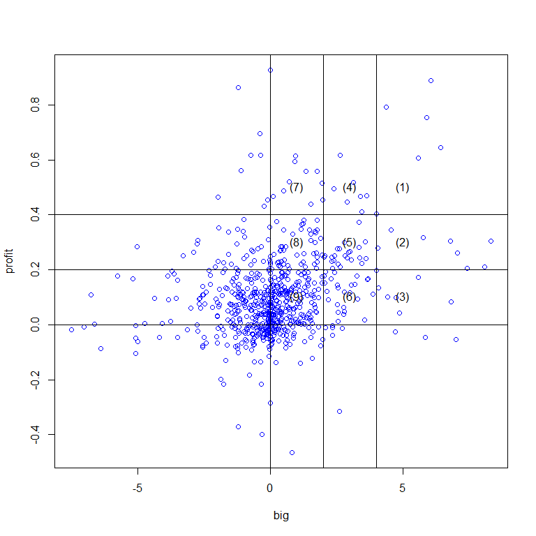

# Stock_Study

##Profit vs. big report (201503)
This report is to analyze the relationship between the stock profit vs.its proportion of
shareholder whose number of stock is larger than 400 (big).


```r
df<-read.csv(file="D:/Stock_Study/P2.csv")
good<-complete.cases(df)
df<-df[good,]
dfs<-filter(df,big<9 & big>-10 & p>20 & profit<1)
```
#Profit vs big plot.
Based on profit and big, we separate nine regions of the stocks.

```r
with(dfs,plot(big,profit,col="blue"))
text(5,0.5,"(1)")
text(5,0.3,"(2)")
text(5,0.1,"(3)")
text(3,0.5,"(4)")
text(3,0.3,"(5)")
text(3,0.1,"(6)")
text(1,0.5,"(7)")
text(1,0.3,"(8)")
text(1,0.1,"(9)")
abline(v=0,h=0.0)
abline(v=2,h=0.2)
abline(v=4,h=0.4)
```

 

#Probability of each profit-big region .
In this table, we calculate the proportion of each stock region.

```r
dfs1<-dfs%>%filter(big>4 & profit>0.4)%>%arrange(desc(profit))%>%mutate(type="(1)",big_region=">4",profit_region=">40%")
dfs2<-dfs%>%filter(big>4 & profit>0.2 & profit<0.4)%>%arrange(desc(profit))%>%mutate(type="(2)",big_region=">4",profit_region="20~40%")
dfs3<-dfs%>%filter(big>4 & profit>0 & profit<0.2)%>%arrange(desc(profit))%>%mutate(type="(3)",big_region=">4",profit_region="0~20%")
dfs4<-dfs%>%filter(big>2 & big<4 & profit>0.4)%>%arrange(desc(profit))%>%mutate(type="(4)",big_region="2~4",profit_region=">40%")
dfs5<-dfs%>%filter(big>2 & big<4 & profit>0.2 & profit<0.4)%>%arrange(desc(profit))%>%mutate(type="(5)",big_region="2~4",profit_region="20~40%")
dfs6<-dfs%>%filter(big>2 & big<4 & profit>0 & profit<0.2)%>%arrange(desc(profit))%>%mutate(type="(6)",big_region="2~4",profit_region="0~20%")
dfs7<-dfs%>%filter(big>0 & big<2 & profit>0.4)%>%arrange(desc(profit))%>%mutate(type="(7)",big_region="0~2",profit_region=">40%")
dfs8<-dfs%>%filter(big>0 & big<2 & profit>0.2 & profit<0.4)%>%arrange(desc(profit))%>%mutate(type="(8)",big_region="0~2",profit_region="20~40%")
dfs9<-dfs%>%filter(big>0 & big<2 & profit>0 & profit<0.2)%>%arrange(desc(profit))%>%mutate(type="(9)",big_region="0~2",profit_region="0~20%")
dfss<-rbind(dfs1,dfs2,dfs3,dfs4,dfs5,dfs6,dfs7,dfs8,dfs9)
dfss1<-group_by(dfss,type,big_region,profit_region)
summarize(dfss1,num=length(type),prob=100*round(num/length(dfss1$type),3))
```

```
## Source: local data frame [9 x 5]
## Groups: type, big_region
## 
##   type big_region profit_region num prob
## 1  (1)         >4          >40%   5  1.6
## 2  (2)         >4        20~40%   8  2.6
## 3  (3)         >4         0~20%   7  2.3
## 4  (4)        2~4          >40%   7  2.3
## 5  (5)        2~4        20~40%  23  7.4
## 6  (6)        2~4         0~20%  26  8.4
## 7  (7)        0~2          >40%  10  3.2
## 8  (8)        0~2        20~40%  46 14.9
## 9  (9)        0~2         0~20% 177 57.3
```

```r
time<-format(Sys.time())
```

#Display the stocks in region 1~9.

Region 1 (big>4, profit>40%)

```r
dfs1
```

```
##    num    stock  big profit      p share type big_region profit_region
## 1 2456   奇力新 6.08 0.8881  50.60 70.61  (1)         >4          >40%
## 2 6228 全譜科技 4.39 0.7910  33.85 57.95  (1)         >4          >40%
## 3 3685     政翔 5.91 0.7547  27.90 61.92  (1)         >4          >40%
## 4 8016     矽創 6.45 0.6432 116.50 64.29  (1)         >4          >40%
## 5 3227 原相科技 5.59 0.6055 105.00 40.16  (1)         >4          >40%
```
Region 2 (big>4, profit=20~40%)

```r
dfs2
```

```
##    num    stock  big profit     p share type big_region profit_region
## 1 4526     東台 4.56 0.3461 35.20 61.37  (2)         >4        20~40%
## 2 3323   加百裕 5.79 0.3169 25.35 30.52  (2)         >4        20~40%
## 3 3035     智原 8.34 0.3049 41.30 46.60  (2)         >4        20~40%
## 4 2393     億光 6.80 0.3037 77.70 69.82  (2)         >4        20~40%
## 5 2383   台光電 4.07 0.2782 46.40 65.03  (2)         >4        20~40%
## 6 6269     台郡 7.06 0.2603 79.90 48.15  (2)         >4        20~40%
## 7 6245 立端科技 8.09 0.2105 45.15 57.75  (2)         >4        20~40%
## 8 5466 泰林科技 7.45 0.2047 25.90 66.76  (2)         >4        20~40%
```
Region 3 (big>4, profit=0~20%)

```r
dfs3
```

```
##    num    stock  big profit      p share type big_region profit_region
## 1 6138 茂達電子 4.01 0.1989  33.75 33.75  (3)         >4         0~20%
## 2 3698     隆達 5.59 0.1733  30.80 76.11  (3)         >4         0~20%
## 3 6294 智基科技 4.08 0.1331  36.60 50.66  (3)         >4         0~20%
## 4 5388     中磊 4.42 0.1002  72.50 61.07  (3)         >4         0~20%
## 5 1536     和大 4.75 0.0991  61.00 69.15  (3)         >4         0~20%
## 6 8271     宇瞻 6.82 0.0833  33.15 40.94  (3)         >4         0~20%
## 7 2498   宏達電 4.87 0.0438 143.00 55.22  (3)         >4         0~20%
```
Region 4 (big=2~4, profit>40%)

```r
dfs4
```

```
##    num    stock  big profit      p share type big_region profit_region
## 1 2368   金像電 2.65 0.6154  21.00 66.74  (4)        2~4          >40%
## 2 2636 台驊國際 3.13 0.5183  41.45 60.64  (4)        2~4          >40%
## 3 4733     上緯 2.41 0.4959 182.50 62.24  (4)        2~4          >40%
## 4 6197   佳必琪 3.63 0.4688  39.95 38.74  (4)        2~4          >40%
## 5 6217 中國探針 3.41 0.4670  48.85 57.38  (4)        2~4          >40%
## 6 3593     力銘 2.91 0.4464  20.90 58.03  (4)        2~4          >40%
## 7 3191 和進電子 3.46 0.4114  22.30 37.72  (4)        2~4          >40%
```
Region 5 (big=2~4, profit=20~40%)

```r
dfs5
```

```
##     num    stock  big profit      p share type big_region profit_region
## 1  9924     福興 3.36 0.3722  39.45 76.72  (5)        2~4        20~40%
## 2  3570 大塚資訊 3.60 0.3011 105.00 66.04  (5)        2~4        20~40%
## 3  8942 森鉅科技 2.80 0.2997  98.00 67.68  (5)        2~4        20~40%
## 4  1702     南僑 3.36 0.2803  61.20 73.44  (5)        2~4        20~40%
## 5  2431     聯昌 2.52 0.2774  27.40 47.89  (5)        2~4        20~40%
## 6  4729 熒茂光學 2.60 0.2754  22.00 57.99  (5)        2~4        20~40%
## 7  3591   艾笛森 3.02 0.2661  29.50 46.46  (5)        2~4        20~40%
## 8  4736     泰博 2.96 0.2647 118.50 61.73  (5)        2~4        20~40%
## 9  5457     宣德 2.42 0.2520  32.05 61.85  (5)        2~4        20~40%
## 10 4958    F臻鼎 2.05 0.2515 103.50 89.12  (5)        2~4        20~40%
## 11 5425     台半 2.83 0.2500  34.25 57.48  (5)        2~4        20~40%
## 12 1710     東聯 2.31 0.2467  28.55 77.06  (5)        2~4        20~40%
## 13 3289 宜特科技 2.02 0.2455  83.20 36.07  (5)        2~4        20~40%
## 14 1477     聚陽 3.39 0.2444 193.50 61.02  (5)        2~4        20~40%
## 15 8213     志超 2.89 0.2444  56.00 61.43  (5)        2~4        20~40%
## 16 6290 良維科技 3.62 0.2402  34.85 56.26  (5)        2~4        20~40%
## 17 6105 瑞傳科技 3.07 0.2367  53.30 54.79  (5)        2~4        20~40%
## 18 9906     興達 2.39 0.2320  40.10 81.33  (5)        2~4        20~40%
## 19 8299 群聯電子 2.32 0.2302 256.50 64.52  (5)        2~4        20~40%
## 20 2499     東貝 3.46 0.2224  33.80 60.38  (5)        2~4        20~40%
## 21 3078 僑威科技 2.57 0.2202  20.50 60.98  (5)        2~4        20~40%
## 22 5478     智冠 2.63 0.2101  95.60 60.27  (5)        2~4        20~40%
## 23 3632 研勤科技 2.34 0.2054  27.00 18.42  (5)        2~4        20~40%
```
Region 6 (big=2~4, profit=0~20%)

```r
dfs6
```

```
##     num    stock  big profit      p share type big_region profit_region
## 1  5306 訊康科技 2.08 0.1938 154.00 66.77  (6)        2~4         0~20%
## 2  1736     喬山 2.44 0.1888  83.10 82.58  (6)        2~4         0~20%
## 3  4105 東洋藥品 3.27 0.1785  68.00 52.09  (6)        2~4         0~20%
## 4  2355     敬鵬 2.03 0.1777  57.00 72.50  (6)        2~4         0~20%
## 5  3553 力積電子 3.70 0.1674  27.20 24.03  (6)        2~4         0~20%
## 6  3702   大聯大 2.29 0.1662  40.70 76.62  (6)        2~4         0~20%
## 7  6274 台燿科技 3.68 0.1657  29.20 64.91  (6)        2~4         0~20%
## 8  3466 致振企業 2.05 0.1526  32.85 68.09  (6)        2~4         0~20%
## 9  2618   長榮航 3.18 0.1467  21.10 83.17  (6)        2~4         0~20%
## 10 6279 胡連精密 3.05 0.1453 134.00 59.02  (6)        2~4         0~20%
## 11 3131 弘塑科技 2.53 0.1439 151.00 39.78  (6)        2~4         0~20%
## 12 1590   AIRTAC 2.56 0.1351 252.00 86.69  (6)        2~4         0~20%
## 13 1590    F亞德 2.56 0.1351 252.00 86.69  (6)        2~4         0~20%
## 14 3060     銘異 2.14 0.1227 151.00 25.00  (6)        2~4         0~20%
## 15 6104 創惟科技 2.80 0.1185  58.50 42.55  (6)        2~4         0~20%
## 16 6166     凌華 3.01 0.1157  83.90 76.47  (6)        2~4         0~20%
## 17 3665    F貿聯 3.88 0.1121 119.00 47.93  (6)        2~4         0~20%
## 18 3205 佰研生化 3.31 0.0931  31.70 56.49  (6)        2~4         0~20%
## 19 3664   KY安瑞 2.18 0.0913  28.70 70.44  (6)        2~4         0~20%
## 20 3630   新鉅科 2.52 0.0724  37.75 32.72  (6)        2~4         0~20%
## 21 3455 由田新技 2.78 0.0630  28.70 33.63  (6)        2~4         0~20%
## 22 1308     亞聚 2.81 0.0481  21.80 57.62  (6)        2~4         0~20%
## 23 6111 大宇資訊 2.55 0.0444  75.30 80.19  (6)        2~4         0~20%
## 24 5604 中連貨運 2.78 0.0377  38.50 67.48  (6)        2~4         0~20%
## 25 3529 力旺電子 3.57 0.0176 318.50 54.29  (6)        2~4         0~20%
## 26 2353     宏碁 2.56 0.0122  20.70 39.83  (6)        2~4         0~20%
```
Region 7 (big=0~2, profit>40%)

```r
dfs7
```

```
##     num    stock  big profit     p share type big_region profit_region
## 1  4938     和碩 0.96 0.6150 88.50 88.30  (7)        0~2          >40%
## 2  9938     百和 0.92 0.5934 67.40 74.84  (7)        0~2          >40%
## 3  4528 江興鍛壓 1.35 0.5586 45.20 68.37  (7)        0~2          >40%
## 4  2615     萬海 1.77 0.5578 35.05 92.58  (7)        0~2          >40%
## 5  3092 鴻碩精密 0.70 0.5208 25.55 52.25  (7)        0~2          >40%
## 6  5505 和旺建設 1.94 0.5155 68.50 72.51  (7)        0~2          >40%
## 7  6187     萬潤 0.51 0.4873 52.50 55.65  (7)        0~2          >40%
## 8  1539     巨庭 0.10 0.4677 22.75 72.18  (7)        0~2          >40%
## 9  2483     百容 1.97 0.4538 27.55 62.78  (7)        0~2          >40%
## 10 2327     國巨 1.53 0.4396 65.50 87.68  (7)        0~2          >40%
```
Region 8 (big=0~2, profit=20~40%)

```r
dfs8
```

```
##     num    stock  big profit      p share type big_region profit_region
## 1  1781 合世生醫 1.77 0.3812  30.80 31.73  (8)        0~2        20~40%
## 2  9907   統一實 1.26 0.3804  23.95 81.69  (8)        0~2        20~40%
## 3  2420     新巨 0.23 0.3750  47.30 63.69  (8)        0~2        20~40%
## 4  3130   一零四 1.23 0.3684 169.00 76.63  (8)        0~2        20~40%
## 5  9904     寶成 1.19 0.3647  45.65 88.27  (8)        0~2        20~40%
## 6  1566 毅金工業 1.15 0.3479  26.15 50.55  (8)        0~2        20~40%
## 7  1307     三芳 0.49 0.3460  39.10 84.89  (8)        0~2        20~40%
## 8  3526 凡甲科技 1.48 0.3453  37.40 27.41  (8)        0~2        20~40%
## 9  1532     勤美 1.76 0.3451  32.35 71.34  (8)        0~2        20~40%
## 10 5349 先豐通訊 1.68 0.3395  50.90 78.66  (8)        0~2        20~40%
## 11 2527     宏璟 1.71 0.3353  22.30 87.58  (8)        0~2        20~40%
## 12 6179 世仰科技 1.52 0.3298  37.30 54.84  (8)        0~2        20~40%
## 13 8070     長華 0.85 0.3295  81.10 61.98  (8)        0~2        20~40%
## 14 6185 幃翔精密 1.89 0.3141  41.00 63.54  (8)        0~2        20~40%
## 15 5310 天剛資訊 1.52 0.3057  34.60 69.75  (8)        0~2        20~40%
## 16 2325     矽品 1.69 0.2992  55.80 90.88  (8)        0~2        20~40%
## 17 1589    F永冠 0.46 0.2840 160.50 70.69  (8)        0~2        20~40%
## 18 3645     達邁 0.58 0.2836  52.50 68.11  (8)        0~2        20~40%
## 19 2395     研華 0.39 0.2835 253.50 88.42  (8)        0~2        20~40%
## 20 2324     仁寶 0.51 0.2714  26.70 78.77  (8)        0~2        20~40%
## 21 2415     錩新 0.39 0.2703  21.85 62.66  (8)        0~2        20~40%
## 22 8091 翔名科技 0.36 0.2690  62.50 36.93  (8)        0~2        20~40%
## 23 3673      TPK 1.73 0.2623 231.00 68.34  (8)        0~2        20~40%
## 24 2062     橋椿 1.64 0.2591  62.20 73.86  (8)        0~2        20~40%
## 25 2390     云辰 1.27 0.2582  36.30 62.05  (8)        0~2        20~40%
## 26 6155     鈞寶 0.14 0.2557  24.80 72.09  (8)        0~2        20~40%
## 27 2497   怡利電 1.96 0.2533  75.20 73.00  (8)        0~2        20~40%
## 28 5490 同亨科技 1.00 0.2528  66.90 53.04  (8)        0~2        20~40%
## 29 3221 台灣嘉碩 0.01 0.2488  25.10 44.90  (8)        0~2        20~40%
## 30 2542   興富發 1.77 0.2462  65.30 77.79  (8)        0~2        20~40%
## 31 4103     百略 0.54 0.2368  70.50 83.51  (8)        0~2        20~40%
## 32 9939     宏全 0.42 0.2309  58.90 44.71  (8)        0~2        20~40%
## 33 4977    F眾達 1.24 0.2282  80.20 60.35  (8)        0~2        20~40%
## 34 5215    F科嘉 1.77 0.2282  47.90 67.90  (8)        0~2        20~40%
## 35 4510 高鋒工業 0.33 0.2274  21.05 46.74  (8)        0~2        20~40%
## 36 2905   三商行 0.26 0.2260  21.70 80.81  (8)        0~2        20~40%
## 37 5347 世界先進 0.49 0.2210  54.70 91.34  (8)        0~2        20~40%
## 38 2311   日月光 1.17 0.2207  43.70 90.62  (8)        0~2        20~40%
## 39 3504   揚明光 1.65 0.2205  62.00 65.24  (8)        0~2        20~40%
## 40 8383 千附實業 0.66 0.2157  37.20 52.14  (8)        0~2        20~40%
## 41 6209   今國光 0.32 0.2148  24.60 46.12  (8)        0~2        20~40%
## 42 1527     鑽全 1.31 0.2103  45.75 44.91  (8)        0~2        20~40%
## 43 2449   京元電 0.37 0.2095  29.15 78.11  (8)        0~2        20~40%
## 44 3596     智易 1.74 0.2054  44.90 54.29  (8)        0~2        20~40%
## 45 2308   台達電 0.71 0.2029 207.50 90.57  (8)        0~2        20~40%
## 46 6143 振曜科技 0.06 0.2022  42.80 28.04  (8)        0~2        20~40%
```
Region 9 (big=0~2, profit=0~20%)

```r
dfs9
```

```
##      num    stock  big profit      p share type big_region profit_region
## 1   4915     致伸 1.42 0.1909  43.35 74.29  (9)        0~2         0~20%
## 2   3416   融程電 1.06 0.1905  62.50 47.65  (9)        0~2         0~20%
## 3   6180     橘子 1.28 0.1898  35.10 59.67  (9)        0~2         0~20%
## 4   4952     凌通 0.65 0.1896  39.85 67.72  (9)        0~2         0~20%
## 5   6177 達麗建設 0.45 0.1896  42.35 79.40  (9)        0~2         0~20%
## 6   6177     達麗 0.45 0.1896  42.35 79.40  (9)        0~2         0~20%
## 7   1319     東陽 0.41 0.1892  38.65 76.86  (9)        0~2         0~20%
## 8   3290     東浦 1.29 0.1879  20.55 35.54  (9)        0~2         0~20%
## 9   8266   中日新 1.16 0.1819  45.15 92.08  (9)        0~2         0~20%
## 10  2514     龍邦 0.57 0.1811  23.15 93.60  (9)        0~2         0~20%
## 11  5212 凌網科技 0.54 0.1782  20.50 59.67  (9)        0~2         0~20%
## 12  2538     基泰 0.44 0.1778  21.20 65.16  (9)        0~2         0~20%
## 13  6286     立錡 1.95 0.1745 175.00 64.03  (9)        0~2         0~20%
## 14  2603     長榮 1.31 0.1743  21.90 84.05  (9)        0~2         0~20%
## 15  4905 台聯電訊 0.15 0.1735  37.20 65.57  (9)        0~2         0~20%
## 16  3023     信邦 0.43 0.1731  48.45 44.75  (9)        0~2         0~20%
## 17  4746     台耀 1.46 0.1661  68.10 53.11  (9)        0~2         0~20%
## 18  8429    F金麗 0.32 0.1652  76.90 72.25  (9)        0~2         0~20%
## 19  8938 明安國際 0.67 0.1651  24.35 52.61  (9)        0~2         0~20%
## 20  3363     上詮 1.43 0.1629  33.55 58.57  (9)        0~2         0~20%
## 21  2029     盛餘 0.03 0.1602  21.00 75.18  (9)        0~2         0~20%
## 22  2404     漢唐 1.09 0.1568  33.20 47.15  (9)        0~2         0~20%
## 23  8109 博大科技 1.01 0.1554  69.90 54.47  (9)        0~2         0~20%
## 24  4138 曜亞國際 0.37 0.1528  81.50 52.06  (9)        0~2         0~20%
## 25  6221 晉泰科技 1.65 0.1516  23.55 48.94  (9)        0~2         0~20%
## 26  6244     茂迪 1.96 0.1508  41.20 53.95  (9)        0~2         0~20%
## 27  6108     競國 1.41 0.1494  22.70 43.20  (9)        0~2         0~20%
## 28  9951 皇田工業 0.43 0.1452 112.00 67.23  (9)        0~2         0~20%
## 29  2330   台積電 0.10 0.1450 150.00 93.82  (9)        0~2         0~20%
## 30  9905     大華 0.14 0.1446  32.05 83.81  (9)        0~2         0~20%
## 31  1733     五鼎 0.96 0.1438  53.30 40.28  (9)        0~2         0~20%
## 32  1531   高林股 1.05 0.1425  23.25 66.88  (9)        0~2         0~20%
## 33  5903     全家 0.24 0.1417 205.50 94.03  (9)        0~2         0~20%
## 34  8261     富鼎 1.43 0.1415  24.20 60.35  (9)        0~2         0~20%
## 35  2231     為升 0.06 0.1410 348.00 66.76  (9)        0~2         0~20%
## 36  2231     為升 0.06 0.1410 348.00 66.76  (9)        0~2         0~20%
## 37  6285     啟碁 0.24 0.1409  73.70 70.49  (9)        0~2         0~20%
## 38  6215     和椿 1.30 0.1371  24.05 51.92  (9)        0~2         0~20%
## 39  3044     健鼎 0.84 0.1370  66.40 82.50  (9)        0~2         0~20%
## 40  1717     長興 0.26 0.1364  33.75 78.18  (9)        0~2         0~20%
## 41  3090   日電貿 0.54 0.1363  27.10 38.11  (9)        0~2         0~20%
## 42  4935    F茂林 0.80 0.1315  46.90 74.07  (9)        0~2         0~20%
## 43  6206     飛捷 0.45 0.1300 126.00 57.14  (9)        0~2         0~20%
## 44  3041     揚智 1.81 0.1288  28.05 33.12  (9)        0~2         0~20%
## 45  3518     柏騰 0.39 0.1258  50.10 55.39  (9)        0~2         0~20%
## 46  6201   亞弘電 0.06 0.1255  26.90 71.43  (9)        0~2         0~20%
## 47  3022   威達電 0.78 0.1253  53.00 55.18  (9)        0~2         0~20%
## 48  2545     皇翔 1.10 0.1248  45.05 81.96  (9)        0~2         0~20%
## 49  5234     達興 0.08 0.1241  44.40 66.55  (9)        0~2         0~20%
## 50  2458     義隆 1.65 0.1238  54.00 51.85  (9)        0~2         0~20%
## 51  5464 霖宏科技 0.58 0.1235  22.75 60.03  (9)        0~2         0~20%
## 52  4126 太平洋醫 0.60 0.1225  72.40 55.09  (9)        0~2         0~20%
## 53  3622     洋華 1.34 0.1221  21.60 40.39  (9)        0~2         0~20%
## 54  4904     遠傳 0.68 0.1218  74.60 95.73  (9)        0~2         0~20%
## 55  5439 高技企業 0.19 0.1214  23.55 43.33  (9)        0~2         0~20%
## 56  5202 力新國際 0.95 0.1181  21.30 52.68  (9)        0~2         0~20%
## 57  3563 牧德科技 0.07 0.1180  55.90 34.94  (9)        0~2         0~20%
## 58  6261 久元電子 0.63 0.1175  67.50 43.49  (9)        0~2         0~20%
## 59  3030     德律 0.27 0.1174  53.30 64.52  (9)        0~2         0~20%
## 60  3045   台灣大 0.57 0.1163 108.50 94.58  (9)        0~2         0~20%
## 61  5522     遠雄 0.77 0.1152  36.30 84.69  (9)        0~2         0~20%
## 62  2454   聯發科 1.23 0.1136 475.50 80.11  (9)        0~2         0~20%
## 63  8349     友信 0.37 0.1129 101.50 79.49  (9)        0~2         0~20%
## 64  6239     力成 0.49 0.1122  54.50 71.25  (9)        0~2         0~20%
## 65  1742     台蠟 0.60 0.1118  28.35 51.77  (9)        0~2         0~20%
## 66  9927     泰銘 0.45 0.1114  37.90 61.08  (9)        0~2         0~20%
## 67  1711     永光 0.04 0.1104  27.65 55.80  (9)        0~2         0~20%
## 68  3149     正達 0.32 0.1104  27.15 53.31  (9)        0~2         0~20%
## 69  8114   振樺電 0.38 0.1100 166.50 61.40  (9)        0~2         0~20%
## 70  8931 大園汽電 0.37 0.1096  23.80 82.31  (9)        0~2         0~20%
## 71  3068 美磊科技 1.52 0.1077  36.00 61.35  (9)        0~2         0~20%
## 72  2376     技嘉 1.62 0.1070  39.30 68.27  (9)        0~2         0~20%
## 73  6230     超眾 1.41 0.1058  95.10 56.21  (9)        0~2         0~20%
## 74  2923    F鼎固 0.06 0.1037  26.60 99.47  (9)        0~2         0~20%
## 75  2464     盟立 0.07 0.1034  29.35 49.75  (9)        0~2         0~20%
## 76  3032     偉訓 0.60 0.1020  24.30 60.81  (9)        0~2         0~20%
## 77  5434     崇越 0.17 0.0993  60.90 40.75  (9)        0~2         0~20%
## 78  1215     卜蜂 1.65 0.0990  27.75 64.66  (9)        0~2         0~20%
## 79  2474     可成 1.83 0.0989 289.00 78.07  (9)        0~2         0~20%
## 80  4906     正文 0.65 0.0978  24.70 38.03  (9)        0~2         0~20%
## 81  1303     南亞 0.15 0.0974  67.60 86.21  (9)        0~2         0~20%
## 82  3026   禾伸堂 0.06 0.0962  45.00 53.82  (9)        0~2         0~20%
## 83  1525     江申 1.16 0.0959  59.40 81.96  (9)        0~2         0~20%
## 84  1213     大飲 0.80 0.0905  21.70 72.90  (9)        0~2         0~20%
## 85  3611 鼎翰科技 0.24 0.0875 248.50 61.92  (9)        0~2         0~20%
## 86  5511 德昌營造 0.62 0.0870  27.50 69.68  (9)        0~2         0~20%
## 87  5371 中強光電 0.25 0.0865  49.00 68.45  (9)        0~2         0~20%
## 88  2459     敦吉 1.07 0.0855  42.55 54.65  (9)        0~2         0~20%
## 89  1301     台塑 0.57 0.0823  75.00 85.95  (9)        0~2         0~20%
## 90  2049     上銀 0.06 0.0821 250.50 65.78  (9)        0~2         0~20%
## 91  4114 健喬信元 0.35 0.0821  42.20 42.47  (9)        0~2         0~20%
## 92  1507     永大 1.57 0.0820  75.20 80.42  (9)        0~2         0~20%
## 93  1466     聚隆 1.04 0.0777  20.80 60.43  (9)        0~2         0~20%
## 94  2392     正崴 1.13 0.0774  55.70 53.30  (9)        0~2         0~20%
## 95  8050     廣積 0.01 0.0753  57.10 23.24  (9)        0~2         0~20%
## 96  6147 頎邦科技 1.66 0.0727  62.00 82.64  (9)        0~2         0~20%
## 97  2373   震旦行 0.02 0.0700  53.50 87.55  (9)        0~2         0~20%
## 98  4506 崇友實業 0.09 0.0691  20.10 79.47  (9)        0~2         0~20%
## 99  1229     聯華 0.64 0.0689  20.95 76.13  (9)        0~2         0~20%
## 100 5493 三聯科技 0.29 0.0678  29.15 41.11  (9)        0~2         0~20%
## 101 5007 三星科技 0.08 0.0642  77.90 83.48  (9)        0~2         0~20%
## 102 3617     碩天 0.72 0.0632  63.90 69.62  (9)        0~2         0~20%
## 103 1434     福懋 0.27 0.0629  32.10 87.64  (9)        0~2         0~20%
## 104 2412   中華電 0.96 0.0629  98.00 80.72  (9)        0~2         0~20%
## 105 5403     中菲 1.70 0.0628  22.85 47.87  (9)        0~2         0~20%
## 106 3015     全漢 0.05 0.0627  27.10 61.53  (9)        0~2         0~20%
## 107 2357     華碩 1.12 0.0621 325.00 75.59  (9)        0~2         0~20%
## 108 1473     台南 0.69 0.0609  27.00 57.75  (9)        0~2         0~20%
## 109 2509   全坤建 0.46 0.0599  23.90 71.53  (9)        0~2         0~20%
## 110 9930   中聯資 0.13 0.0593  71.50 80.44  (9)        0~2         0~20%
## 111 6183 關貿網路 0.91 0.0590  27.80 74.34  (9)        0~2         0~20%
## 112 6183     關貿 0.91 0.0590  27.80 74.34  (9)        0~2         0~20%
## 113 2433   互盛電 0.87 0.0586  45.15 81.02  (9)        0~2         0~20%
## 114 1337    F再生 0.72 0.0556  38.95 64.82  (9)        0~2         0~20%
## 115 6128     上福 0.22 0.0549  34.60 64.30  (9)        0~2         0~20%
## 116 2904     匯僑 0.29 0.0491  27.80 52.34  (9)        0~2         0~20%
## 117 2915   潤泰全 0.57 0.0490  66.40 83.12  (9)        0~2         0~20%
## 118 6121 新普科技 0.34 0.0487 161.50 69.51  (9)        0~2         0~20%
## 119 1451     年興 0.39 0.0486  25.90 74.10  (9)        0~2         0~20%
## 120 5013 強新工業 1.51 0.0482  20.65 63.22  (9)        0~2         0~20%
## 121 5009 榮剛材料 1.72 0.0481  21.80 46.89  (9)        0~2         0~20%
## 122 3088     艾訊 1.73 0.0466  74.10 62.68  (9)        0~2         0~20%
## 123 8240 華宏新技 0.13 0.0445  32.85 56.83  (9)        0~2         0~20%
## 124 1203     味王 0.42 0.0444  23.50 80.57  (9)        0~2         0~20%
## 125 2347     聯強 0.87 0.0437  45.40 85.15  (9)        0~2         0~20%
## 126 1726     永記 0.38 0.0423  83.70 84.97  (9)        0~2         0~20%
## 127 4536     拓凱 1.46 0.0396 118.00 80.05  (9)        0~2         0~20%
## 128 8048 德勝科技 0.41 0.0395  30.25 62.52  (9)        0~2         0~20%
## 129 2382     廣達 0.05 0.0385  78.20 93.85  (9)        0~2         0~20%
## 130 2616     山隆 0.12 0.0383  24.40 68.41  (9)        0~2         0~20%
## 131 8916     光隆 1.17 0.0369  40.70 64.70  (9)        0~2         0~20%
## 132 4144    F康聯 0.04 0.0362  71.50 59.13  (9)        0~2         0~20%
## 133 5015 華祺工業 0.06 0.0358  23.15 52.83  (9)        0~2         0~20%
## 134 4532     瑞智 1.25 0.0357  31.90 76.84  (9)        0~2         0~20%
## 135 9946 金革科技 0.11 0.0355  20.40 76.88  (9)        0~2         0~20%
## 136 9946     三發 0.11 0.0355  20.40 76.88  (9)        0~2         0~20%
## 137 2910     統領 0.12 0.0354  36.60 98.10  (9)        0~2         0~20%
## 138 1236     宏亞 0.28 0.0309  25.00 84.00  (9)        0~2         0~20%
## 139 2421     建準 0.19 0.0302  20.50 57.93  (9)        0~2         0~20%
## 140 1442     名軒 0.71 0.0299  24.10 75.02  (9)        0~2         0~20%
## 141 1565 精華光學 1.26 0.0282 510.00 49.72  (9)        0~2         0~20%
## 142 5203     訊連 0.77 0.0272  90.60 55.30  (9)        0~2         0~20%
## 143 6234     高僑 1.53 0.0272  30.20 50.19  (9)        0~2         0~20%
## 144 9911     櫻花 1.38 0.0261  21.65 63.92  (9)        0~2         0~20%
## 145 5536     聖暉 1.13 0.0256  80.20 31.43  (9)        0~2         0~20%
## 146 4127     天良 0.16 0.0246  22.90 33.56  (9)        0~2         0~20%
## 147 1787 福盈科技 1.47 0.0231  28.80 58.11  (9)        0~2         0~20%
## 148 4128 中天生技 0.43 0.0229  26.85 42.93  (9)        0~2         0~20%
## 149 1216     統一 0.60 0.0215  52.30 89.00  (9)        0~2         0~20%
## 150 2430     燦坤 0.19 0.0207  32.00 68.92  (9)        0~2         0~20%
## 151 2031   新光鋼 0.96 0.0202  20.20 40.81  (9)        0~2         0~20%
## 152 1730   花仙子 0.39 0.0173  29.45 64.06  (9)        0~2         0~20%
## 153 3491 昇達科技 1.52 0.0148  68.70 34.78  (9)        0~2         0~20%
## 154 2466   冠西電 0.79 0.0147  34.50 92.69  (9)        0~2         0~20%
## 155 1326     台化 0.06 0.0131  69.50 89.69  (9)        0~2         0~20%
## 156 5609   中菲行 0.86 0.0130  23.30 52.85  (9)        0~2         0~20%
## 157 2106     建大 0.86 0.0127  63.80 86.11  (9)        0~2         0~20%
## 158 9908   大台北 0.03 0.0108  23.40 83.39  (9)        0~2         0~20%
## 159 6154 順發電腦 0.38 0.0096  21.10 61.20  (9)        0~2         0~20%
## 160 3036     文曄 1.01 0.0095  47.95 69.81  (9)        0~2         0~20%
## 161 3587 閎康科技 0.07 0.0094  64.70 44.78  (9)        0~2         0~20%
## 162 4527   方土霖 0.30 0.0090  27.95 66.52  (9)        0~2         0~20%
## 163 1233     天仁 0.03 0.0086  47.00 69.57  (9)        0~2         0~20%
## 164 6204 台灣艾華 1.09 0.0084  24.00 64.00  (9)        0~2         0~20%
## 165 2476     鉅祥 0.27 0.0074  27.40 64.52  (9)        0~2         0~20%
## 166 2480   敦陽科 0.98 0.0070  28.75 38.89  (9)        0~2         0~20%
## 167 2385     群光 0.46 0.0057  87.50 85.90  (9)        0~2         0~20%
## 168 2105     正新 1.23 0.0055  73.60 88.60  (9)        0~2         0~20%
## 169 2908     特力 0.46 0.0049  20.40 82.66  (9)        0~2         0~20%
## 170 1533   車王電 1.59 0.0048  63.00 71.50  (9)        0~2         0~20%
## 171 2704     國賓 1.05 0.0036  27.70 80.29  (9)        0~2         0~20%
## 172 4916   事欣科 1.29 0.0033  30.10 52.83  (9)        0~2         0~20%
## 173 6203 海韻電子 0.13 0.0031  47.95 71.05  (9)        0~2         0~20%
## 174 2002     中鋼 1.17 0.0019  25.90 60.10  (9)        0~2         0~20%
## 175 2424     隴華 0.77 0.0013  39.20 74.03  (9)        0~2         0~20%
## 176 9926     新海 0.07 0.0012  42.05 85.59  (9)        0~2         0~20%
## 177 2606     裕民 0.75 0.0011  46.60 68.57  (9)        0~2         0~20%
```

Report time:2015-03-15 12:46:25
